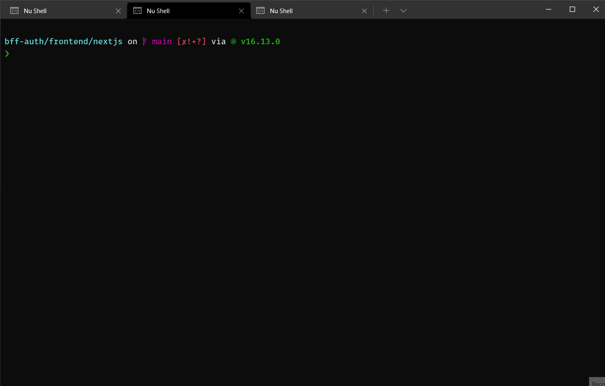
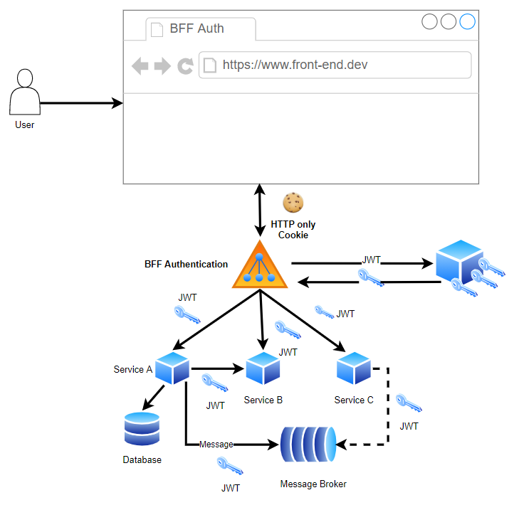

# Why BFF for Authentication?

TODO

# When to use BFF Auth with Cookies-based
- Used: 
  - Cookies (Same site) and move the authentication to the trusted backend
  - Use a dedicated backend for SPA now and move the security to the trusted backend
  - Azure does not support introspection or the revocation endpoint so you cannot invalidate the tokens, or logout an Azure SPA fully. BFF removes this problem
- Not used:
  - High load apps or cross domain with high load
  - In this case, please use tokens, but it has a risk of tokens to be robbed in the client-side

# Get starting

- Start frontend

```bash
# Start front-end
> cd frontend/bff-auth-nextjs
> yarn dev
```

- Start backend

```bash
# Start auth-server, BFF server, and sale-api
> tye run
```

- Go to `https://localhost:8080`, and start to play with it



# High level architecture



# Hosts and Services

<table>
  <tr>
    <td>No.</td>
    <td>Name</td>
    <td>Technical Stacks</td>
    <td>URI</td>
  </tr>
  <tr>
    <td>1</td>
    <td>Gateway (BFF Auth)</td>
    <td>.NET 6 (YARP)</td>
    <td>https://localhost:8080</td>
  </tr>
  <tr>
    <td>2</td>
    <td>Duende.IdentityServer</td>
    <td>.NET 6</td>
    <td>https://localhost:5001</td>
  </tr>
  <tr>
    <td>3</td>
    <td>Product API</td>
    <td>Rust (Axum, Tower, Hyper, Tokio)</td>
    <td>http://localhost:5003</td>
  </tr>
  <tr>
    <td>4</td>
    <td>Sale API</td>
    <td>Golang (fiber)</td>
    <td>http://localhost:5004</td>
  </tr>
  <tr>
    <td>5</td>
    <td>Ship API (TODO)</td>
    <td>.NET 6</td>
    <td>http://localhost:5005</td>
  </tr>
  <tr>
    <td>5</td>
    <td>Web</td>
    <td>Nextjs</td>
    <td>http://localhost:3000</td>
  </tr>
</table>

# References
- RFC-8693: https://github.com/RockSolidKnowledge/TokenExchange
- https://datatracker.ietf.org/doc/html/draft-ietf-oauth-browser-based-apps-08
- https://github.com/manfredsteyer/yarp-auth-proxy
- https://developer.okta.com/blog/2021/01/04/offline-jwt-validation-with-go
